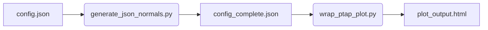

# ptapplot
A python library for making pressure tap plots

*Click the images to view interactive Plotly visualizations*

| 2D Needle Plot | 3D Dot Plot |
| :---: | :---: |
| [](https://raw.githack.com/PaulENorman/ptapplot/main/demo_data/drivAer_lineplot/drivAer_multi_series.html) | [](https://raw.githack.com/PaulENorman/ptapplot/main/demo_data/drivAer_dotplot/drivAer_dotplot.html) |

## Usage Flow

### 2D Line Plots (Needles)
1. **Source Configuration**: Define your vehicle image, physical extents, and CSV tap data in a `.json` file.
2. **Preprocessing**: Run `generate_json_normals.py` to calculate surface normals and prepare the data.
3. **Rendering**: Run `wrap_ptap_plot.py` to generate the interactive HTML Plotly visualization.



### 3D Dot Plots (Geometry Overlay)
1. **Source Configuration**: Define paths to your STL geometry, tap positions, and results CSVs in a `.json` file.
2. **Rendering**: Run `dot_plot.py` to generate a 3D Plotly scene. Supports side-by-side comparison with synced cameras.

### Installation
```bash
pip install -r requirements.txt
```

### Quick Start
```bash
# 2D Needle Plot
python generate_json_normals.py demo_data/drivAer_lineplot/drivAer_top.json
python wrap_ptap_plot.py demo_data/drivAer_lineplot/drivAer_top_complete.json

# 3D Dot Plot
python dot_plot.py demo_data/drivAer_dotplot/dotplot_config.json
```

## Advanced Features

### 3D Dot Plot Configuration
The `dotplot_config.json` supports several visualization overrides:
- `mesh_opacity`: Transparency of the vehicle geometry.
- `scale_by_value`: (bool) Dynamically size dots based on $C_p$ magnitude.
- `offset`: (float) Lift dots off the STL surface to prevent z-fighting clipping.
- `camera`: Initial eye, center, and up vectors for the 3D scene.

### JSON Configuration Options (2D)

## Advanced Features

### JSON Configuration Options
The source `.json` supports Python-style `#` comments and the following keys:

- `image_path`: Path to the background PNG/JPG.
- `taps`: Array of CSV-formatted strings (header: `number,x,y,z,Case1,Case2...`).
- `extents`: Physical bounding box of the vehicle (`x_min`, `x_max`, etc.).
- `line_breaks`: List of tap-number pairs `[ID1, ID2]` to disconnect the plot line between.
- `normals_flip`: (bool) Reverses the direction of all calculated surface normals (useful if plots are appearing "inside" the vehicle).
- `cp_scale`: Scaling factor for the local $C_p$ axes (pixels per unit $C_p$).
- `series_preferences`: Array of style objects (keys: `line_color`, `line_width`, `line_dash`, `show_markers`, `marker_symbol`).

### Normal Relaxation
To improve plot legibility in regions with complex geometry, enable relaxation in the JSON:

- `relax_normals`: (bool) Enables the relaxation pipeline.
- `relax_iterations`: (int) Number of smoothing passes (e.g., 50).
- `relax_factor`: (float) Strength of the smoothing blend (0.0 to 1.0).
- `relax_uncross`: (bool) Prevents local axes from converging/crossing within the plot range.
- `relax_fix_endpoints`: (bool) Keeps segment start/end normals fixed to their true geometric orientation.

## Developer Features
- **Auto-Formatting**: The project is configured for **Ruff** (formatting and import sorting) with VS Code settings provided in `.vscode/`.
