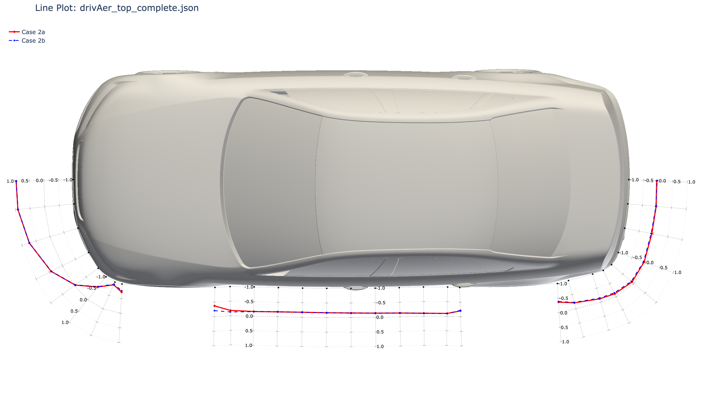
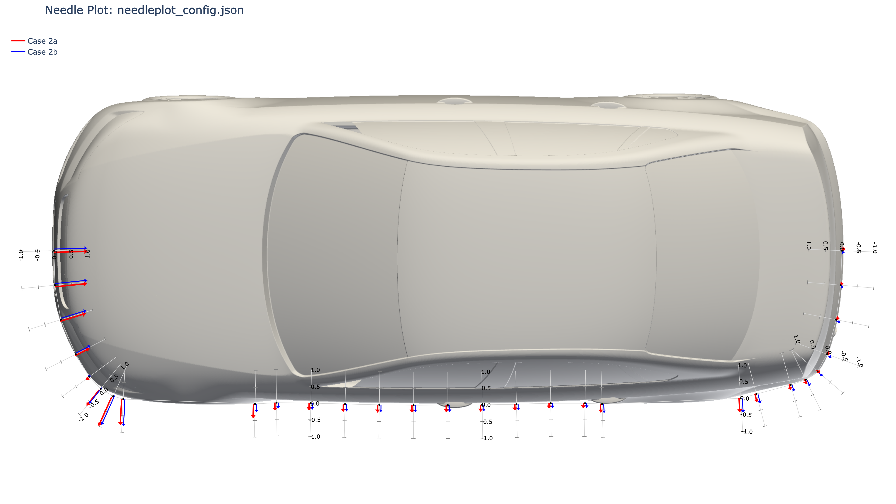
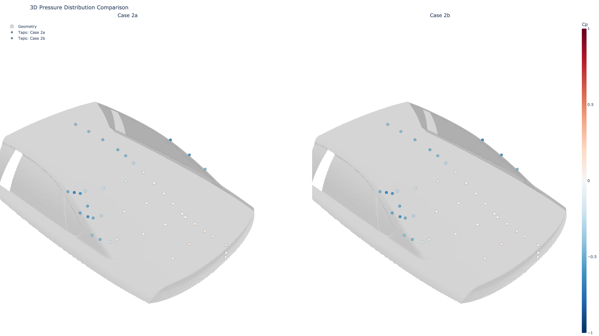

# ptapplot
A python library for making pressure tap plots

*Click the images to view interactive Plotly visualizations*

| Plot Type | Preview |
| :--- | :---: |
| **2D Line Plot** | [](https://raw.githack.com/PaulENorman/ptapplot/main/demo_data/drivAer_lineplot/drivAer_multi_series.html) |
| **2D Needle Plot** | [](https://raw.githack.com/PaulENorman/ptapplot/main/demo_data/drivAer_needleplot/drivAer_needleplot.html) |
| **3D Dot Plot** | [](https://raw.githack.com/PaulENorman/ptapplot/main/demo_data/drivAer_dotplot/drivAer_dotplot.html) |

The data for these demos was obtained from https://autocfd.org/


## Installation

```bash
# Clone the repository
git clone https://github.com/PaulENorman/ptapplot.git
cd ptapplot

# Install in editable mode
pip install -e .
```

## Usage Flow

### 2D Line Plots
1. **Source Configuration**: Define your vehicle image, physical extents, and CSV tap data in a `.json` file.
2. **Preprocessing**: (Optional) Calculate surface normals.
3. **Rendering**: Generate the interactive HTML Plotly visualization.

```bash
# 1. Prepare (Optional if running plot directly)
ptap-2d-prep demo_data/drivAer_lineplot/drivAer_top.json

# 2. Render plot
ptap-2d-plot demo_data/drivAer_lineplot/drivAer_top_complete.json
```

*Note: `ptap-2d-plot` will automatically trigger the prep step if normals are missing from the configuration.*

### 3D Dot Plots (Geometry Overlay)
1. **Source Configuration**: Define paths to your STL geometry, tap positions, and results CSVs in a `.json` file.
2. **Rendering**: Generate a 3D Plotly scene with side-by-side comparison and synced cameras.

```bash
ptap-3d-plot demo_data/drivAer_dotplot/dotplot_config.json
```

### 2D Needle Plots
1. **Source Configuration**: Same as Line Plots (normals auto-generated if missing).
2. **Rendering**: Generates a plot with individual $C_p$ bars at each tap location.

```bash
ptap-needle-plot demo_data/drivAer_needleplot/needleplot_config.json
```

Needle plots show individual bars instead of a connected line. Positive $C_p$ (pressure) points inward toward the body, negative $C_p$ (suction) points outward. Multiple series are offset perpendicular to the normal for clarity. Note that the needles are more or less normal to the adjacent normal y-axes, not the exact surface at that point (although these are close).

